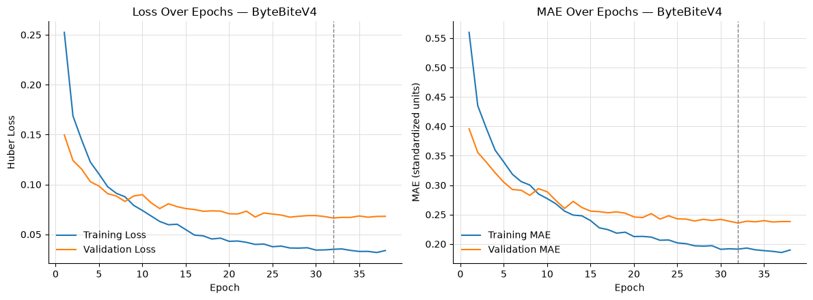

# ByteBite

**A deep learning tool for real-time estimation of food nutritional components to support diabetes self-management.**

ByteBite estimates a meal's calories, mass, carbohydrates, protein, and fat from a single overhead smartphone photograph, with no manual logging. It is built to run as an Android application so that dietary tracking costs a patient one photo instead of a search-and-enter workflow.

Undergraduate research conducted through the NSSRP summer research program at Benedictine University.
**Authors:** Saim Sultan, Ismail Abu-Shanab, Husam Ghazaleh, Ph.D.

---

## Why

Diabetes affects roughly 40.1 million people in the United States, about 12% of the population, and costs the healthcare system an estimated $412.9 billion a year. Tracking carbohydrates and calories is central to managing blood glucose, but existing apps are either tedious (manual logging) or expensive. Carbohydrate intake in particular drives postprandial glycemic response and insulin dosing, so accuracy on that target matters most.

## Data

Trained on [Nutrition5k](https://arxiv.org/abs/2103.03375), a dataset of real cafeteria dishes with high-accuracy nutrition labels.

- Removed dishes with zero recorded calories: 4,766 remaining
- Cross-referenced against available overhead RGB images: 3,260 dishes
- Removed one dish with a physically implausible nutrition label: **3,259 dishes final**
- Split at the dish level, 70/15/15: 2,281 train / 488 validation / 490 test
- Split built on fixed indices and verified to contain no dish in more than one set

## Models

Three CNNs, all doing multi-output regression on the five nutritional targets from a single RGB image. Adam optimizer, Huber loss, targets standardized with training-set statistics.

| Model | Backbone | Input | Head |
|---|---|---|---|
| EfficientNetB3 | EfficientNetB3, ImageNet | 300×300 | GAP → Dense(256, ReLU) → Dropout(0.3) → Dense(5) |
| EfficientNetV2B0 | EfficientNetV2B0, ImageNet | 180×180 | GAP → Dropout(0.3) → Dense(256, ReLU) → Dense(5) |
| Residual CNN | Trained from scratch | 180×180 | Flatten → Dropout(0.4) → Dense(256) → Dropout(0.3) → Dense(128) → Dense(5) |

EfficientNetB3 unfreezes the upper backbone blocks while keeping batch normalization frozen. EfficientNetV2B0 is fine-tuned in two phases: regression head first, then the full backbone at a reduced learning rate. The Residual CNN uses five convolutional blocks (32–512 filters) with ReLU, batch norm, max pooling, and skip connections in the deeper blocks.

## Results

Mean absolute error per nutrient, with 95% bootstrap confidence intervals over 1,000 resamples of pooled test predictions from five independent runs.

| Model | Calories (kcal) | Mass (g) | Carbs (g) | Protein (g) | Fat (g) |
|---|---|---|---|---|---|
| **EfficientNetB3** | **42.02** (40.20–44.00) | **27.00** (26.00–28.06) | **4.12** (3.95–4.28) | **4.29** (4.03–4.54) | **3.17** (3.02–3.31) |
| EfficientNetV2B0 | 48.99 (46.58–51.31) | 31.84 (30.54–33.29) | 7.42 (7.14–7.69) | 6.72 (6.38–7.04) | 4.41 (4.20–4.61) |
| Residual CNN | 49.63 (47.38–51.86) | 34.02 (32.49–35.68) | 7.92 (7.64–8.22) | 7.09 (6.71–7.52) | 4.70 (4.50–4.91) |
| SnapNutrition (baseline) | 101.89 (98.48–105.36) | 69.23 (66.64–71.70) | 10.47 (10.17–10.79) | 11.29 (10.84–11.72) | 8.33 (8.00–8.65) |

EfficientNetB3 wins on every target, with the largest margins on carbohydrate and protein. All three models beat the SnapNutrition baseline. The two best models both use ImageNet pretraining, which suggests transfer learning suits a training set this size; EfficientNetB3's higher input resolution and orientation augmentation appear to resolve the finer visual cues separating carbs from protein.



*Figure 1. Training and validation loss and mean absolute error per epoch for the fine-tuned EfficientNetB3 model. Mean absolute error is shown in standardized target units.*

## Android app

A Kotlin / Jetpack Compose application that runs the model **on the phone**: capture an overhead photo, get the five estimates, log it. No server and no `INTERNET` permission, so neither the photo nor the estimate can leave the device.

The trained Keras model is converted to LiteRT (TensorFlow Lite) by [`notebooks/bytebite_android_export.ipynb`](notebooks/bytebite_android_export.ipynb), which also writes the preprocessing contract and a parity fixture into the app's `assets/`. `float16` ships by default at 22.3 MB; `int8` would be 13.0 MB and is only adopted if post-quantization carbohydrate MAE degrades by less than 0.10 g, which is checked on the full test set rather than assumed.

| | size | on CPU | shipped |
|---|---|---|---|
| float32 | 44.4 MB | reference | no |
| **float16** | **22.3 MB** | GPU-delegate eligible | **yes** |
| int8 | 13.0 MB | fastest | only if it clears the accuracy gate |

`android/README_MODEL.md` covers the routes considered (LiteRT variants, ONNX Runtime Mobile, ExecuTorch, a lighter backbone), the delegate choices, and the three preprocessing details that silently break this kind of port. The `.tflite` is not committed; with `assets/` empty the app builds and runs as the UI prototype on sample data, clearly labelled as such.

To build it, open `android/` in Android Studio, or run `./gradlew installDebug` from that folder with a device attached. [`android/README.md`](android/README.md) has the full steps and the tests.

## Future work

- **Depth.** Nutrition5k ships overhead depth images that this work does not use. Depth should improve portion size estimation, which is the main source of calorie and mass error.
- **Downstream models.** Extend the app with a model estimating blood glucose response following food intake or exercise, and one estimating HbA1c, so dietary estimates feed glycemic management directly instead of sitting as isolated numbers.

## Repository layout

```
notebooks/
  bytebite_v4_walkthrough.md   cell-by-cell write-up of the v4 fine-tuning line:
                               resolution, augmentation, and unfreezing changes that
                               took overall MAE 21.59 -> 18.14 (17.33 with a 5-model
                               ensemble), plus the negative result on text-alignment heads
  bytebite_nutrition5k_model_comparison.ipynb   model comparison and evaluation
  bytebite_android_export.ipynb                 Keras -> LiteRT conversion: three
                               quantization variants, test-set accuracy cost of each,
                               a pre-registered gate on which one ships, and the
                               assets the phone needs to reproduce the notebook
android/                       Kotlin / Jetpack Compose app
  README_MODEL.md              conversion routes considered, delegates, and the
                               preprocessing contract the app must honour
paper/                         write-up and figures
```

Set `NUTRITION5K_DIR` to your local Nutrition5k path before running the notebooks.
## References

1. Thames et al., "Nutrition5k: Towards Automatic Nutritional Understanding of Generic Food," arXiv:2103.03375, 2021.
2. CDC, "National Diabetes Statistics Report," 2023.
3. NIDDK, "Diabetes Statistics," 2024.
4. American Diabetes Association, "Economic Costs of Diabetes in the U.S. in 2022," *Diabetes Care*, 47(1), 26–43, 2024.
5. Yeramosu, "AC215_snapnutrition: Nutrition5k EDA Base Model," GitHub.
