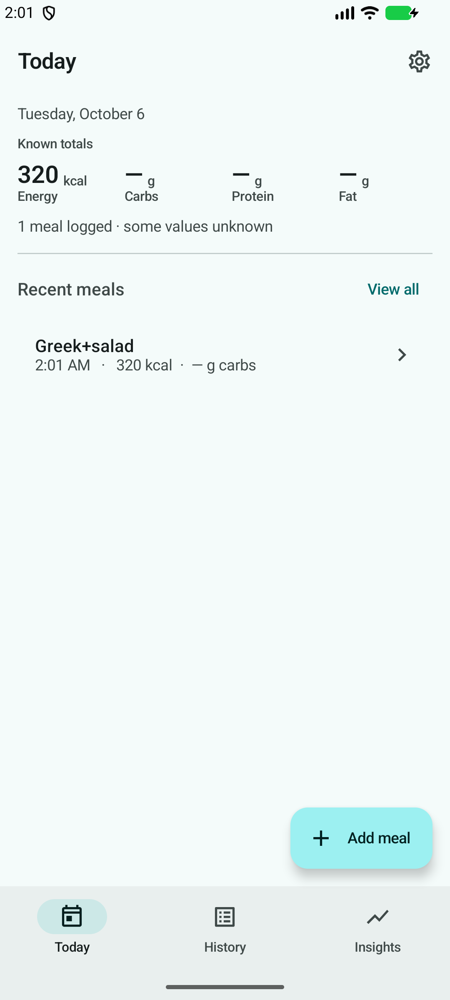
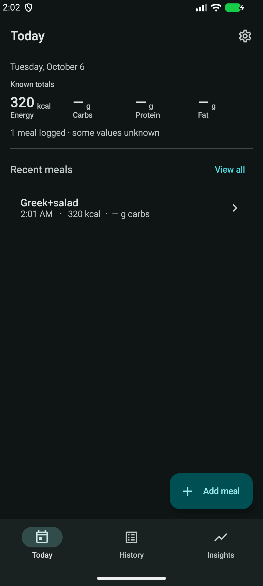
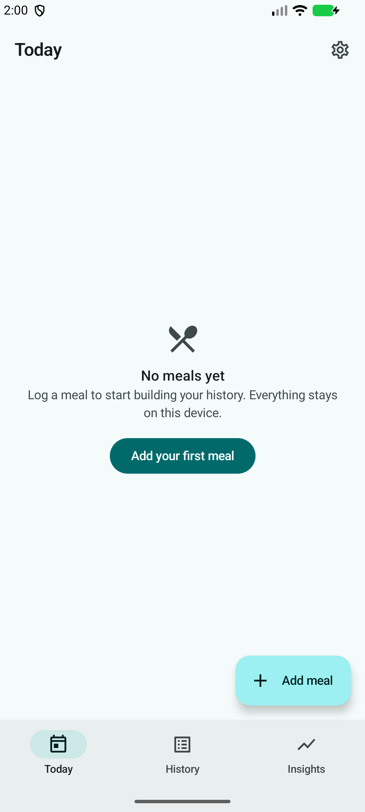
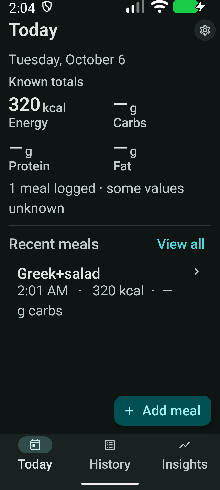
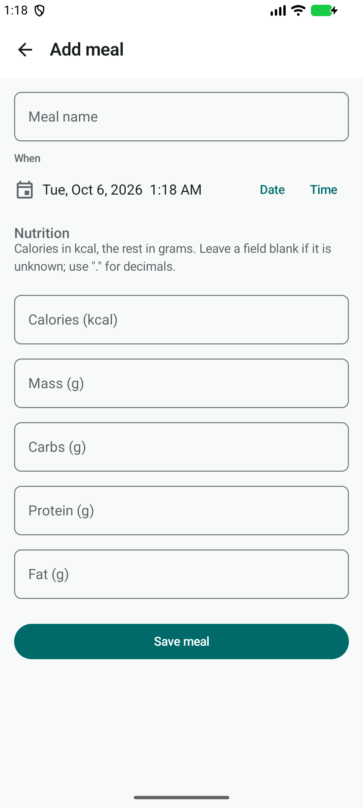
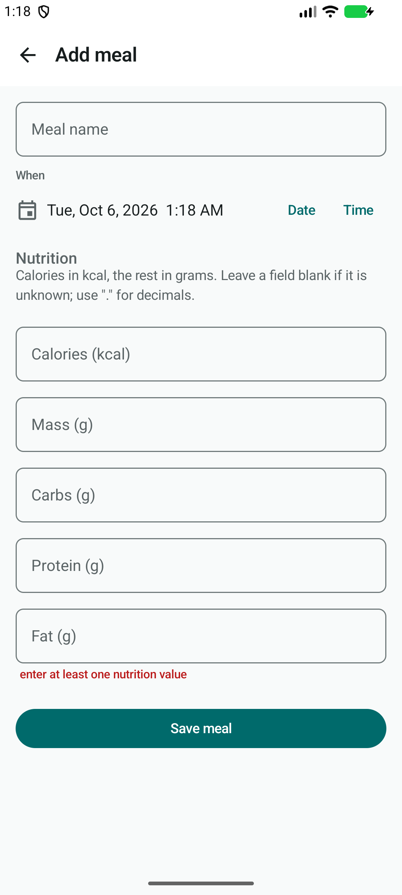
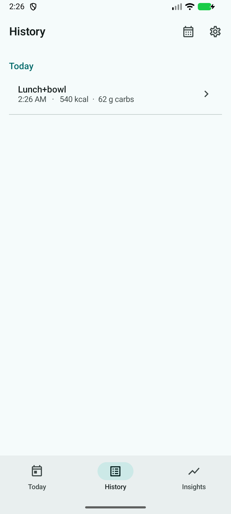
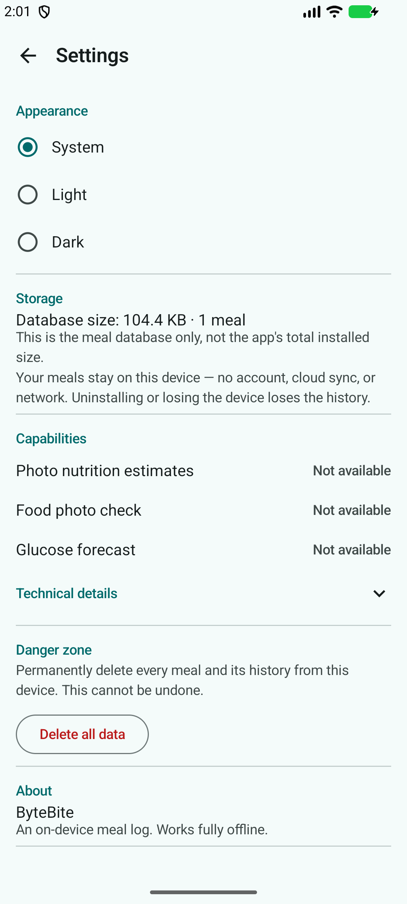

# Android UI design notes

How the ByteBite Android interface is designed and why. The visual direction
(calm, research-focused; teal accent) is this project's choice, not a quotation
from any vendor.

## Official references applied

The design follows the principles in these official pages. They were used as
design guidance; the concrete decisions below are the project's own.

1. **Common layouts** — https://developer.android.com/design/ui/mobile/guides/layout-and-content/common-layouts
   Applied as a list/detail structure: Today is a summary with one primary
   action, History is a navigable list, and a meal opens a focused detail
   screen. The home screen is **not** a data-entry form followed by an unbounded
   list — entry is a separate destination.
2. **Material 3 foundations** — https://m3.material.io/foundations/
   Reusable tokens and components instead of per-screen styling (see below).
3. **Material typography** — https://m3.material.io/styles/typography/applying-type
   A restrained set of semantic roles (headlineSmall / titleLarge / titleMedium
   / body / label). Numeric statistics use tabular figures and separate the
   value from its unit.
4. **Compose accessibility defaults** — https://developer.android.com/develop/ui/compose/accessibility/api-defaults
   Material components, meaningful semantics, and >=48 dp targets. Custom
   composables (meal row, stat) are checked rather than assumed: the meal row
   merges its children into one labelled button node, decorative icons use a
   null contentDescription, and action icons are labelled.
5. **Material Symbols** — https://developers.google.com/fonts/docs/material_symbols
   One vector icon family, bundled at build time via
   `androidx.compose.material:material-icons-extended` — no icon font is fetched
   at runtime.

These pages were not re-fetched during implementation; the implementation
applies their established guidance. Where a specific value is this project's
decision rather than a reference requirement, it is called out as such.

## Design tokens (`ui/theme`)

Centralized so no screen hardcodes a color, size, or type style.

- **Color** (`Color.kt`, `Theme.kt`): near-white neutral background, white/subtle
  surfaces, deep slate text, one teal primary accent, semantic error only. Light
  and dark are separate `ColorScheme`s, each tuned for contrast; dynamic color is
  off for a consistent research palette. Light and dark share layout, type, and
  shapes.
- **Typography** (`Type.kt`): system sans-serif (Roboto) on the M3 type scale;
  no oversized serif headline. `StatNumberStyle` adds `tnum` tabular figures for
  changing statistics.
- **Spacing** (`Shape.kt`): a 4 / 8 / 12 / 16 / 24 / 32 dp scale; 16 dp page
  gutters. Shapes are 12–16 dp for surfaces; buttons follow Material defaults.
- **Components** (`ui/components/CommonUi.kt`, `meal/ui/MealRow.kt`): screen
  scaffolds, section header, empty state, inline validation, loading, error/retry,
  nutrient stat, and the meal row.

## Screen map

- **Today** — compact title + date, a summary of energy/carbs/protein/fat that
  labels partial totals ("Known totals") when any logged meal has unknown
  values, a recent-meals preview, an honest empty state, and one Add-meal action.
- **History** — `LazyColumn` grouped by day with text-led rows (name, time,
  compact nutrition; unknowns as an em dash). Row opens detail.
- **Meal details** — name, time, source, all five values; original-vs-corrected
  and technical details in expandable sections; edit and confirmed delete.
- **Add/Edit** — a dedicated screen: name, editable date/time, grouped nutrition
  fields in one column with a decimal keyboard and IME Next/Done, inline
  validation, an in-flight-guarded Save, and a save-failure snackbar.
- **Insights** — honest "no insights available yet" state; no placeholder charts.
- **Settings** — working appearance (System/Light/Dark), measured storage usage,
  delete-all with confirmation, and honest per-capability model status.

Navigation: bottom bar (Today / History / Insights); Settings via an app-bar
icon; Add/Edit and Detail are pushed destinations with back navigation.

## No emoji / no fake data

No emoji or text-glyph buttons in app-authored UI. No sample meals, fake charts,
fabricated confidence, or simulated glucose. The old sample-data chooser and the
Fusion/Kitchen/Glucose prototype screens were removed from the app.

## Screenshots

QA screenshots use synthetic meals (e.g. "Chicken"), not personal data, captured
on the emulator.

| | |
|---|---|
| Today (light) |  |
| Today (dark) |  |
| Today (empty) |  |
| Today (200% font) |  |
| Add meal |  |
| Add meal — validation |  |
| History |  |
| Settings |  |

## Color roles and system bars

Every Material role is defined for both themes from the teal/slate palette, so
no component falls back to the violet baseline (the navigation indicator,
dialogs, and container surfaces are all teal/slate). Status- and navigation-bar
icon contrast is set from the resolved theme, so icons stay readable in light,
dark, and when the theme is switched in app. Verified on the emulator in light
and dark and at 200% font scale (the summary folds to a 2x2 grid).
