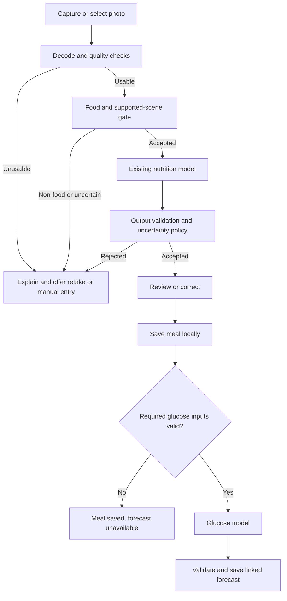

# Model integration

Status: proposed pipeline. No food gate or glucose model has been integrated.

## Existing nutrition baseline

Retain EfficientNetB3 as the initial comparison baseline. Locate the actual trained artifact and matching split/scaler before export. Reconcile [documented result differences](../research/14-reading-the-results.md).

The current Android path is system camera/gallery → orientation correction/downsampling → model-specific geometry → raw RGB 0–255 → LiteRT → de-standardization. Current model output order is calories, mass, fat, carbohydrate, protein. Preserve that contract explicitly; do not rely on UI ordering.

The repository's existing parity fixture uses an already resized image. It does not by itself verify the full camera/EXIF/crop pipeline. Add raw-image fixtures and real-device capture comparisons.

## Proposed flow

## Food and quality gate

Evaluate a small separate classifier first, avoiding immediate changes to nutrition training. Train/evaluate with varied food and non-food examples, including hard negatives such as toy food, screens, packaging, and empty plates.

Distinguish food presence from supported input. One tiny food region in a large scene may pass a food classifier and still be unsuitable. Assess food coverage/framing and unsupported scene categories.

Use separate outcomes for non-food, quality failure, unsupported input, and uncertainty. Do not call every rejected image “not food.” Thresholds must balance non-food acceptance, food rejection, coverage, and nutrition error on accepted images.

Classifier confidence is not nutrition confidence or proof of familiarity. Consider calibrated rejection and unfamiliar-input detection; no detector guarantees zero false positives. Select thresholds using validation data, then evaluate once on held-out data.

## Output and uncertainty policy

Reject NaN/infinity and material physical inconsistencies before display. Define any tolerance for tiny negative regression noise from validation; do not silently turn large invalid predictions into plausible zeros.

Current test MAE is a dataset aggregate, not an individual-photo interval. Do not present it as a calibrated personal error bound. Evaluate regression uncertainty methods before exposing intervals: a learned variance head requires retraining; ensembles increase storage and inference cost; repeated dropout inference needs a compatible export and validation. Defer the method choice until measured.

A glucose model may be sensitive to nutrition error. Evaluate the combined pipeline using predicted nutrients and compare it with measured-nutrient inputs. Never fabricate missing glucose features.

## Professor's model intake

Obtain and record:

- Artifact format, architecture, framework/converter versions, size, and permission to distribute.
- Exact ordered features, units, normalization, missing-value policy, and supported ranges.
- Required glucose history, sampling frequency, medication/activity/profile inputs, and freshness rules.
- Output definition: curve, peak, change, or point forecast; horizon, timestamps, units, uncertainty.
- Intended population, held-out-subject results, personalization requirements, and limitations.
- CPU/mobile compatibility, memory/latency, and known unsupported operations.

Keep nutrition and glucose services separate behind versioned contracts. A glucose failure must not prevent meal storage.

## Mobile verification

Proposed runtimes: LiteRT on Android and Core ML on iOS; confirm actual conversion feasibility. Match preprocessing and output semantics across Python and phones. Set per-output parity tolerances before evaluation.

Verify CPU and accelerated paths, including initialization and runtime failures. Serialization by mutex alone does not establish GPU thread affinity; inspect runtime requirements and use an appropriate execution context. Ensure a documented fallback or explicit unavailable state.

Bundle validated model/metadata versions together, check hashes/contracts, and avoid partially installed combinations. Release checks must fail if required model assets are missing rather than skipping inference tests.

## References

- [LiteRT](https://developers.google.cn/edge/litert/overview)
- [Core ML conversion](https://apple.github.io/coremltools/docs-guides/source/tensorflow-2.html)
- [Confidence on unfamiliar inputs](https://arxiv.org/abs/2106.04972)
