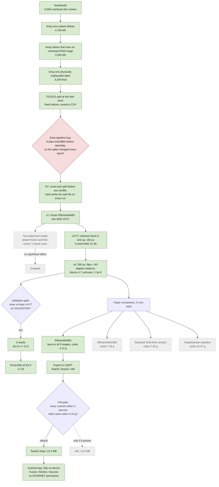

# 01. Research journey

The whole project on one page: what was tried, in what order, what it scored, and what was kept. Green boxes survived into the final system. Grey dashed boxes were tried and dropped. Diamonds are decisions.

MAE is mean absolute error on the held-out test dishes, averaged over the five targets in real units. Lower is better.

## Each step in one line

- **Data cleanup.** A model can't learn from a dish with no image. A zero-calorie label is almost always a recording error, not a glass of water. See [04](04-dataset.md).
- **Dish-level split.** Test dishes must be dishes the model has never seen, or the score measures memory instead of skill. See [05](05-split-and-leakage.md).
- **The leakage bug.** The early pipeline shuffled the whole dataset every epoch and then cut it into train/val/test. So every epoch had a different "test set", and the model eventually trained on all of it. The fix makes the split a file that every run must match exactly. See [05](05-split-and-leakage.md).
- **v1, frozen backbone (29.57).** Reuse ImageNet features as they are and train only a small head. It's cheap, safe, and a floor to beat. See [07](07-model-choice.md).
- **Text heads (dropped).** Extra outputs trained to align image features with text descriptions of the dish. On one seed it looked like a win. Across five seeds it did nothing. See [13](13-negative-result-text-heads.md).
- **v3-FT, fine-tuning (21.59).** Let the top of the backbone adapt to food. This was the largest single jump. See [09](09-fine-tuning.md).
- **v4 (18.14).** Higher resolution, orientation augmentation, and a deeper unfreeze with a smaller learning rate, all changed together. See [10](10-resolution-and-augmentation.md) and [09](09-fine-tuning.md).
- **Validation gate.** v4 only replaced v3-FT because it won on validation. The test set was read afterwards, for the record. See [11](11-validation-gate.md).
- **Ensemble (17.33).** Five seeds make partly independent mistakes, and averaging cancels some of them. See [12](12-seeds-and-ensemble.md).
- **Paper comparison.** Three architectures against a public baseline, each with five runs and bootstrap CIs. See [07](07-model-choice.md) and [14](14-reading-the-results.md).
- **Export gate.** int8 is 4x smaller, but it only ships if it barely touches accuracy, and carbs get the strictest bar. See [15](15-on-device-export.md).
- **App.** Inference runs on the phone, so the meal photo never leaves the device. See [16](16-port-pitfalls-and-next-steps.md).

## The shape of the gains

| Step | Overall test MAE | Change |
|---|---|---|
| v1 frozen EfficientNetB3 | 29.57 | |
| v3 fine-tuned, 5-seed mean | 21.59 | -7.98 |
| v4, 5-seed mean | 18.14 | -3.45 |
| v4 ensemble of 5 | 17.33 | -0.81 |

The biggest win came from letting the network adapt to food at all (v1 to v3). Each later step bought less. That pattern is normal. Once the obvious bottleneck is gone, you're fighting smaller ones: portion size without depth, lighting, and plates that hide food.

## Check yourself

Why is the split built before the leakage fix in the diagram, when the bug was in the split?

The 70/15/15 idea was always there. The bug was in how it was applied: shuffling with `reshuffle_each_iteration` before `take`/`skip` re-drew the membership each epoch. The fix kept the same ratios but froze the membership into a file.

Which single step bought the most accuracy?

Fine-tuning (v1 to v3-FT, about -8 MAE). Frozen ImageNet features know edges and textures but not "how much rice is on this plate". Letting the top blocks move is what taught that.

