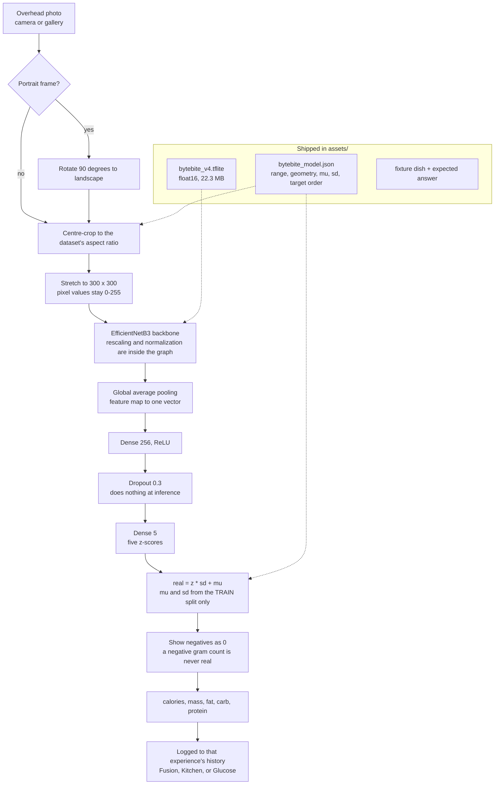
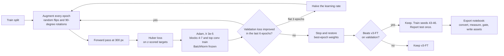

# 02. Final pipeline

Two diagrams. The first is what happens on the phone every time someone scans a plate. The second is how the weights inside that phone were produced.

## On the phone: photo to numbers

### Stage by stage

1. **Rotate portrait to landscape.** Phones default to 3:4 portrait, but the Nutrition5k rig shot 4:3 landscape. Cropping a portrait photo to 4:3 would throw away almost half the plate. v4 trained with random 90-degree rotations, so the model doesn't care which way is up, and rotating loses nothing.
2. **Centre-crop to the dataset's aspect ratio, then stretch.** Training resized the full 4:3 frame to a 300x300 square with no crop, which squashes everything horizontally. The phone must squash the same way, or food looks a different size than it did in training. A square crop would be the natural instinct, and it would make portions look smaller and bias mass and calories low.
3. **Keep pixels in 0-255.** Keras' EfficientNetB3 does its own rescaling inside the model. Dividing by 255 in Kotlin would normalize twice and produce confident, plausible, wrong numbers. See [16](16-port-pitfalls-and-next-steps.md).
4. **Backbone, pooling, head.** The same layers as training. Global average pooling turns the spatial feature map into one vector describing the whole plate. That's why the model gives one answer per dish and has no per-ingredient breakdown.
5. **Dropout.** It's only active during training. At inference it passes values through unchanged.
6. **Un-standardize.** The head predicts z-scores (see [06](06-target-scaling.md)). The phone converts them back with the train-split mean and standard deviation, which travel in the JSON sidecar. Target order is `[calories, mass, fat, carb, protein]`, not alphabetical. Mixing it up swaps fat and carbs.
7. **Floor at zero.** On lean plates the regression head can dip slightly below zero (the app once showed "-0.2 g" fat). A negative gram count is never a real reading, so the display floors it at 0.
8. **Log it.** Each scan is stored in the history of the experience it came from. Inference runs on one background thread behind a mutex, because a LiteRT interpreter can't be called concurrently.

## Offline: how the weights were made

Why each piece is there is covered in [08](08-loss-and-training.md) (loss, optimizer, stopping), [09](09-fine-tuning.md) (what trains), [10](10-resolution-and-augmentation.md) (augmentation), [11](11-validation-gate.md) (the gate), and [15](15-on-device-export.md) (export).

## Check yourself

Why does the phone crop at all, if training never cropped?

Training never cropped because every Nutrition5k frame already had the same 4:3 shape. Phone photos come in other shapes. Cropping to 4:3 first gives the phone the same starting shape, so the stretch to 300x300 distorts food exactly the way training did.

What goes wrong if the sidecar's mu and sd come from all 3,259 dishes instead of the train split?

The model learned to output z-scores relative to train-split statistics. Using different statistics shifts and rescales every prediction a little. The numbers still look reasonable, so nothing flags the error. It's also leakage: validation and test labels would have influenced the pipeline.

